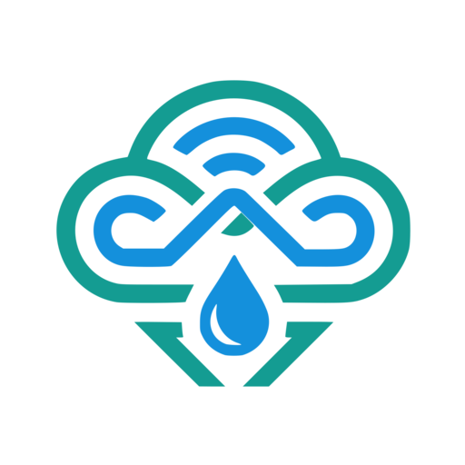

  

<h1 align="center">LocalSky for Home Assistant</h1>

  <strong>Your backyard weather station and smart irrigation, as native Home Assistant entities.</strong> 
  Discovered automatically. Updated in under a second. No YAML.

  
  
  
  
  

[LocalSky](https://github.com/silenthooligan/localsky) is a local-first hyperlocal weather and irrigation engine that runs as one container on your LAN. This integration is the bridge: it finds your LocalSky, subscribes to its live streams, and turns everything it knows into Home Assistant entities you can automate against.

Full setup guide: **[localsky.io/docs/hacs](https://localsky.io/docs/hacs)**

## Why you'll like it

- **Instant.** State arrives over server-sent events, not polling. A zone starts watering and Home Assistant knows in under a second.
- **Zero config.** LocalSky announces itself on the network; Home Assistant offers to add it. Pair, done.
- **Grows with the server.** Entities are driven by LocalSky's own manifest. Add a zone or a sensor in LocalSky and it appears in Home Assistant, no integration update, no restart.
- **Complete control.** Open and close zone valves, suspend irrigation, tune skip thresholds, and call `run_zone` / `stop_zone` / `stop_all` services from automations.
- **Secure by default.** Instances with authentication enabled pair with an API token, and a guided reauth flow handles rotation.
- **Multi-instance.** Test bed and production, or one per property. Each instance is its own device.

## What you get

| Surface | Entities |
|---|---|
| Weather | A full weather entity (conditions + daily forecast) backed by your own station |
| Station | Temperature, feels like, humidity, dew point, wind speed/gust/direction, pressure, rain today, rain intensity, solar, UV, lightning, station battery |
| Engine | Today's run/skip verdict and reason, days since rain, ET0, water level, heat multiplier, rain probability |
| Per zone | Soil moisture, soil temperature, EC, probe battery, soil bucket, planned run, minutes run today, running state, and a valve |
| Controls | Irrigation suspend switch, rain/wind/freeze threshold numbers |
| Services | `localsky.run_zone`, `localsky.stop_zone`, `localsky.stop_all` |

## Install

**One click** (opens your own Home Assistant):

Install **LocalSky** when HACS opens, then restart Home Assistant.

**Or by hand**: HACS, three-dot menu, **Custom repositories**, add `https://github.com/silenthooligan/localsky-hacs` as category **Integration**, install, restart. (Default-catalog inclusion is pending review; until then the repository adds as a custom one either way.)

## Pair

If LocalSky is already running on your LAN, Home Assistant discovers it and prompts you. Otherwise:

Enter the host and port (default `8090`). Instances with auth enabled will ask for an API token, created in LocalSky under Settings, Account.

## Requirements

- Home Assistant **2024.11** or newer
- A reachable [LocalSky](https://github.com/silenthooligan/localsky) **0.2.0** or newer

## No LocalSky yet?

- **Home Assistant OS / Supervised**: install the server as a
  [Home Assistant app](https://github.com/silenthooligan/localsky-apps),
  one click and it runs right next to HA (this integration then discovers
  it automatically):

  

- **Anywhere else Docker runs**: follow the
  [quick start](https://localsky.io/docs/getting-started), it is one
  container.

## Contributing

Bug reports and PRs welcome. Engine, weather source, or controller issues belong on the main [LocalSky repo](https://github.com/silenthooligan/localsky/issues); config flow, entity, or pairing issues belong [here](https://github.com/silenthooligan/localsky-hacs/issues).

## License

Apache-2.0. See [LICENSE](LICENSE).
